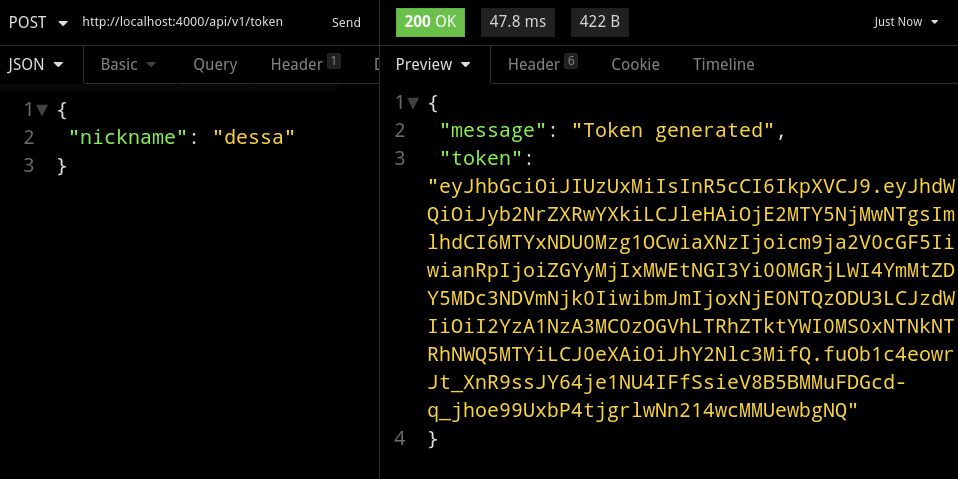

# Rocketpay

To start your Phoenix server:

  * Install dependencies with `mix deps.get`
  * Create and migrate your database with `mix ecto.setup`
  * Start Phoenix endpoint with `mix phx.server`

Now you can visit [`localhost:4000`](http://localhost:4000) from your browser.

Ready to run in production? Please [check our deployment guides](https://hexdocs.pm/phoenix/deployment.html).

# Iniciar o servidor
  * Iniciar o banco de dados no docker
    `docker run --rm --name postgres -e POSTGRES_PASSWORD=postgres -p 5432:5432 -d postgres` 
  * Acessar o terminal
    `iex -S mix`

# Milha extra
 * Adicionado dependência para criação de Bearer tokens
 * Criado uma rota para gerar Bearer tokens para usuários da aplicação
 * Teste desse novo controlador e do módulo utilizado por esse controlador
  

    
  

## Learn more

  * Official website: https://www.phoenixframework.org/
  * Guides: https://hexdocs.pm/phoenix/overview.html
  * Docs: https://hexdocs.pm/phoenix
  * Forum: https://elixirforum.com/c/phoenix-forum
  * Source: https://github.com/phoenixframework/phoenix

